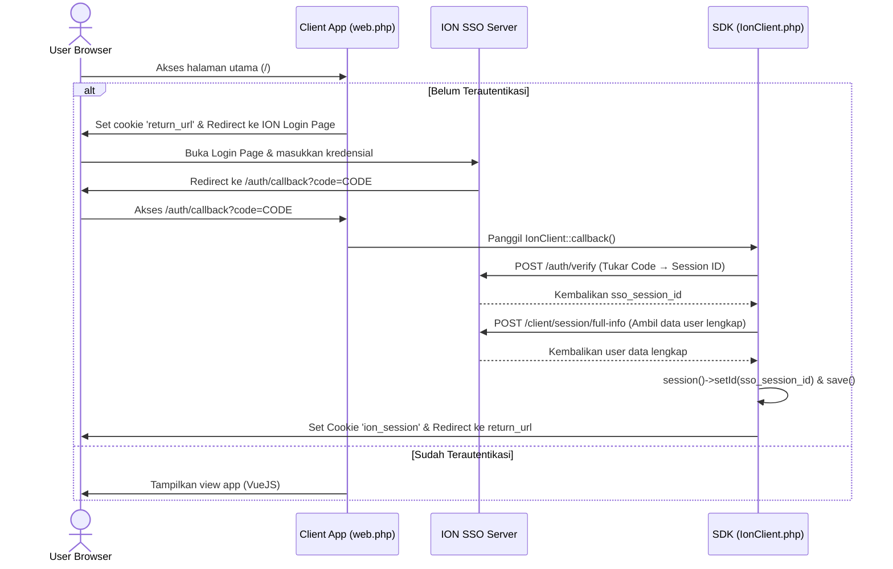
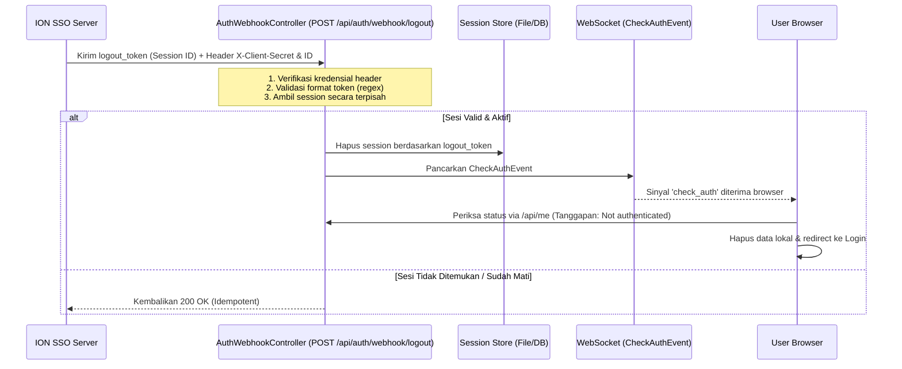

# Catatan Pengembang (Developer Notes) - Integrasi ION SSO v2

Dokumen ini berisi panduan lengkap untuk pengembang mengenai struktur proyek, konfigurasi, cara menjalankan aplikasi, alur kerja SSO, serta aspek keamanan dan performa penting pada proyek **ion-client-example**.

---

## 1. Struktur Proyek

Berikut adalah berkas dan direktori utama yang digunakan untuk integrasi SSO:

*   **`config/ion-client.php`**: Berkas konfigurasi untuk SDK `ptpn/ion-client`. Mengatur URL dasar API ION SSO, kredensial client (ID & Secret), timeout koneksi, setelan cookie, dan alamat redirect frontend.
*   **`routes/web.php`**: Menangani rute web utama:
    *   `/auth/callback`: Menerima kode otorisasi dari ION SSO dan memproses login lokal.
    *   `/*` (Fallback SPA): Memastikan jika user belum terautentikasi, mereka akan diarahkan ke login page ION SSO dengan membawa parameter redirect yang valid dan cookie `return_url`.
*   **`routes/api.php`**: Menangani rute API:
    *   `/me`: Memvalidasi session dan cookie user, menyensor data sensitif (masking), menyamarkan ID database (hashing), lalu mengembalikan informasi user yang aman ke frontend.
    *   `/logout`: Melakukan pemutusan session di sisi server ION SSO, menghancurkan session lokal Laravel, dan membersihkan cookie session browser.
    *   `/auth/webhook/logout`: Endpoint publik (POST) yang dipanggil oleh server ION SSO secara back-channel ketika terjadi logout global.
*   **`app/Http/Controllers/Auth/AuthWebhookController.php`**: Controller khusus untuk menangani webhook logout back-channel.
*   **`app/Events/Auth/CheckAuthEvent.php`**: Event WebSocket yang dipicu setelah webhook logout selesai memproses penghancuran session, agar browser client segera mendeteksi logout secara real-time.
*   **`resources/js/components/HelloWorld.vue`**: Frontend Vue 3 sederhana yang menampilkan status login, detail user (nama & email), serta tombol logout.

---

## 2. Konfigurasi Lingkungan (`.env`)

Konfigurasi berikut wajib diatur di file `.env` proyek Anda agar integrasi berjalan mulus:

```env
# --- LARAVEL SESSION CONFIG ---
# Session cookie name harus disamakan dengan cookie name ION
SESSION_DRIVER=file
SESSION_COOKIE=ion_session
SESSION_LIFETIME=1440
SESSION_ENCRYPT=false

# --- ION SSO API CONFIG ---
ION_ENABLED=true
ION_BASE_URL=https://ion.palmco.id/api/v2
ION_CLIENT_ID=iniID
ION_CLIENT_SECRET=iniSecret
ION_TIMEOUT=30
ION_VERIFY_SSL=true

# --- CALLBACK & FRONTEND REDIRECT ---
# Port default frontend Vite untuk VueJS
ION_CLIENT_FRONTEND_URL=http://localhost:5173

# --- COOKIE SESSION CONFIG ---
ION_CLIENT_COOKIE_NAME=ion_session
ION_CLIENT_COOKIE_LIFETIME=1440
ION_CLIENT_COOKIE_DOMAIN=null
ION_CLIENT_COOKIE_SECURE=false
ION_CLIENT_COOKIE_HTTP_ONLY=true
ION_CLIENT_COOKIE_SAMESITE=Lax
```

> [!IMPORTANT]
> Pastikan nilai `SESSION_COOKIE` di `.env` **sama** dengan nilai `ION_CLIENT_COOKIE_NAME` agar Laravel mengenali session ID yang diset oleh SDK ION SSO.

---

## 3. Cara Menjalankan Proyek (How to Run)

Ikuti langkah-langkah di bawah ini untuk menjalankan backend (Laravel) dan frontend (VueJS) secara lokal:

### Langkah 1: Persiapan Awal
Pastikan dependency PHP (Composer) dan Javascript (npm/bun) sudah terinstal:
```bash
# Menginstal dependency & membuat key / database sqlite bawaan
composer run setup
```

### Langkah 2: Menjalankan Server Development
Gunakan perintah `dev` yang telah dioptimalkan untuk menjalankan server Laravel, Vite, queue worker, dan log pail secara bersamaan:
```bash
npm run dev
```
Perintah ini akan membuka beberapa proses:
*   **Laravel Backend (Server)**: Berjalan di `http://localhost:8000`
*   **Vite Frontend (Vue 3)**: Berjalan di `http://localhost:5173`

### Langkah 3: Pengujian Alur Login
1. Buka browser dan akses **`http://localhost:5173`**.
2. Anda akan otomatis dialihkan ke halaman login ION SSO (`https://ion.palmco.id/auth/login`).
3. Setelah berhasil login di SSO, server SSO akan mengembalikan browser Anda ke URL Callback Anda (`http://localhost:8000/auth/callback?code=AUTH_CODE`).
4. SDK ION SSO akan menangkap kode tersebut di backend, menukarnya dengan Session ID dan data profil user, lalu mengarahkan Anda kembali ke frontend `http://localhost:5173` dengan status **Login ✅**.

---

## 4. Alur Kerja Integrasi SSO

### A. Alur Login & Callback (Front-Channel)


### B. Webhook Logout (Back-Channel)
Ketika user melakukan logout dari aplikasi lain yang terhubung dengan SSO, server ION SSO akan mengirimkan sinyal logout global ke endpoint webhook aplikasi client untuk menghapus session lokal:


---

## 5. Keamanan & Performa (Perhatian Penting)

Berikut adalah beberapa implementasi keamanan dan kelemahan arsitektur yang wajib dipahami oleh pengembang:

### 1. Masking & Hashing Data untuk Frontend (`routes/api.php`)
Demi kepatuhan data pribadi (PII) dan keamanan internal, data user dari SSO **tidak boleh dikirim mentah-mentah ke frontend**.
*   **Hiding / Hashing Integer ID**: Field `company_id`, `unit_id`, `department_id`, dan `position_id` secara otomatis disamarkan menjadi string hash dengan algoritma SHA-256 menggunakan `app.key` sebagai salt (contoh: `hash-company-7a3f5b9c`). Langkah ini mencegah penyerang melakukan enumerasi data perusahaan/organisasi.
*   **PII Masking**: Field `cellphone_number`, `username`, `nik_sap`, dan `telegram_id` otomatis disensor pada bagian tengahnya (contoh: `08*****7890`, `88****88`).

### 2. Validasi Token Session ID (`AuthWebhookController.php`)
Untuk menangani session di webhook logout secara dinamis, controller memanggil method handler session secara manual.
*   **Bahaya Traversal & File Deletion (CWE-22 / CWE-73)**: Karena session driver bawaan menggunakan berkas (`file`), nilai `logout_token` yang tidak divalidasi dapat disusupi karakter *path traversal* (seperti `../../../../.env`). Jika ini terjadi, fungsi `destroy()` di Laravel akan menghapus file sensitif di server (seperti berkas konfigurasi `.env`).
*   **Pencegahan**: Kami telah menerapkan aturan validasi ketat menggunakan ekspresi reguler `/^[a-zA-Z0-9\-_]{20,256}$/` untuk memastikan parameter token hanya berisi string ID sesi yang valid sebelum diproses oleh filesystem.

### 3. Autentikasi Webhook Logout (`AuthWebhookController.php`)
Webhook `/auth/webhook/logout` bersifat publik agar dapat dijangkau oleh server ION SSO. Namun, tanpa pengamanan, endpoint ini rentan disalahgunakan penyerang untuk mematikan sesi user secara acak (DoS).
*   **Pencegahan**: Kami mengamankan endpoint ini dengan memverifikasi header `X-Client-ID` dan `X-Client-Secret` (atau HTTP Basic Auth sebagai fallback) yang dikirim oleh server ION SSO. Hanya server yang memiliki kecocokan kredensial yang diizinkan mematikan sesi.

### 4. Idempotensi Webhook Logout
Saat server SSO memicu webhook logout untuk sesi yang sudah kedaluwarsa atau sudah tidak aktif, controller akan tetap mengembalikan status **200 OK** daripada memicu error HTTP 401. Hal ini mencegah *retry loops/storms* dari server SSO yang dapat membebani server aplikasi secara sia-sia.

### 5. Rekomendasi Session Driver untuk Production
*   **Masalah dengan File Driver**: Pada lingkungan multi-server (load-balanced), session driver `file` akan menyimpan berkas sesi secara lokal di masing-masing server. Akibatnya, webhook logout mungkin mendarat di Server A, namun sesi user tersimpan di Server B, sehingga logout global gagal dilakukan.
*   **Rekomendasi**: Selalu gunakan session driver yang terpusat seperti **Redis** atau **Database** pada lingkungan production.

### 6. Peringatan Keamanan: Paparan Client Secret di Browser URL (`routes/web.php`)
Saat ini, login redirect memformat URL sebagai berikut:
`https://ion.palmco.id/auth/login?client_key=CLIENT_ID&client_identifier=CLIENT_SECRET&redirect_uri=...`
> [!CAUTION]
> Mengirimkan `client_secret` (pada parameter `client_identifier`) melalui URL di peramban web adalah **celah keamanan kritis** (Client Secret Leakage). Parameter URL terekam di riwayat peramban (browser history), log server proxy, log server tujuan, dan referer headers.
> 
> Rekomendasi perbaikan jangka panjang adalah memperbarui konfigurasi sistem ION SSO agar proses login di front-channel peramban **hanya** memerlukan `client_id` (sebagai `client_key`) dan `redirect_uri` saja. Nilai `client_secret` hanya boleh digunakan pada jalur back-channel server-to-server (seperti pada metode `verify()`).
